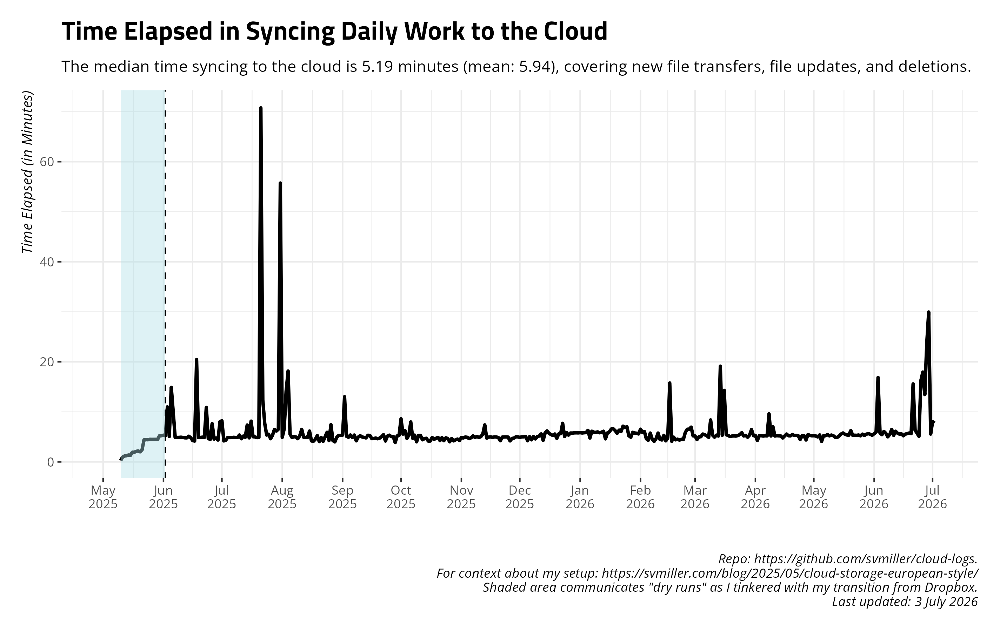
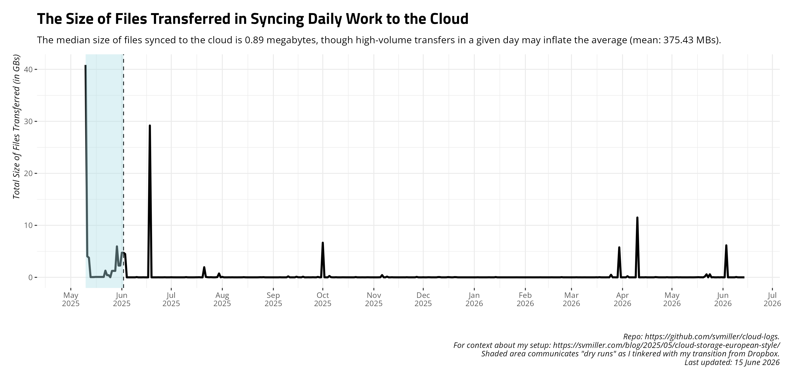
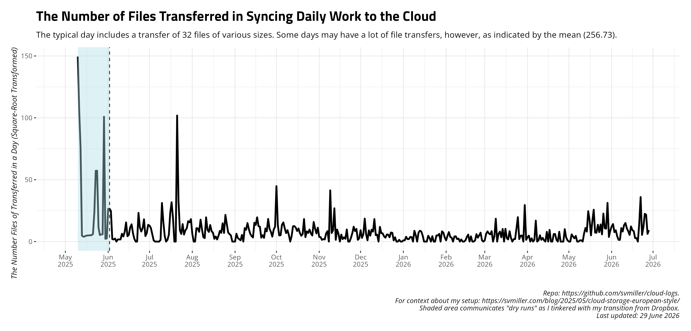

# A Summary of Daily Cloud Syncs

This is a silly project of mine to track/automate my daily work activity
and syncs to my cloud storage. You can [read a bit more about my setup
here](https://svmiller.com/blog/2025/05/cloud-storage-european-style/).
Every day, I sync my main cloud storage to a backup cloud provider and
log the files transferred, the total size of files transferred, and the
time elapsed to sync my main cloud storage provider to my backup. This
script and repository gathers the last two measures and formats them for
presentation. I have an automated procedure that does this every morning
and uploads to Github.

## Time Elapsed Syncing to Cloud, Daily

## Total Size of Files Transferred, Daily

## Total Number of Files Transferred, Daily

## Summary of Past 14 Days

    #> # A tibble: 14 × 4
    #>    date       ftransfer stransfer   elapsed
    #>    <date>         <dbl> <chr>       <chr>  
    #>  1 2026-03-31         2 21.604 KiB  5m14.1s
    #>  2 2026-04-01        12 28.383 KiB  5m15.9s
    #>  3 2026-04-02        23 6.745 MiB   4m16.9s
    #>  4 2026-04-03         0 <NA>        5m14.8s
    #>  5 2026-04-04         7 220.335 MiB 5m13.2s
    #>  6 2026-04-05         0 <NA>        5m9.7s 
    #>  7 2026-04-06         2 37.269 KiB  5m12.6s
    #>  8 2026-04-07       287 <NA>        5m11.3s
    #>  9 2026-04-08         0 <NA>        9m36.6s
    #> 10 2026-04-09         1 882.068 KiB 5m10.4s
    #> 11 2026-04-10        26 11.506 GiB  7m1.3s 
    #> 12 2026-04-11         2 6.212 KiB   5m10.0s
    #> 13 2026-04-12         9 1.208 MiB   5m14.0s
    #> 14 2026-04-13         1 7.343 MiB   5m11.9s
