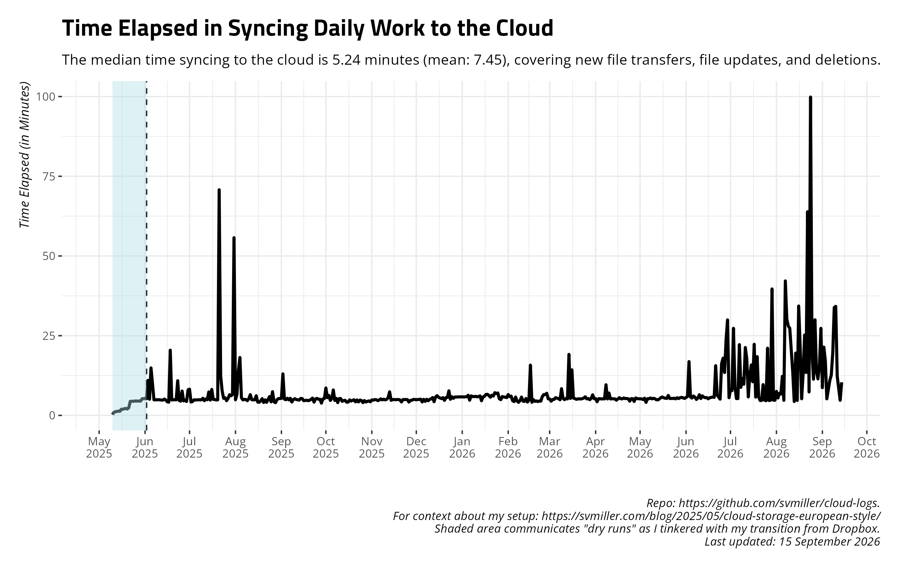
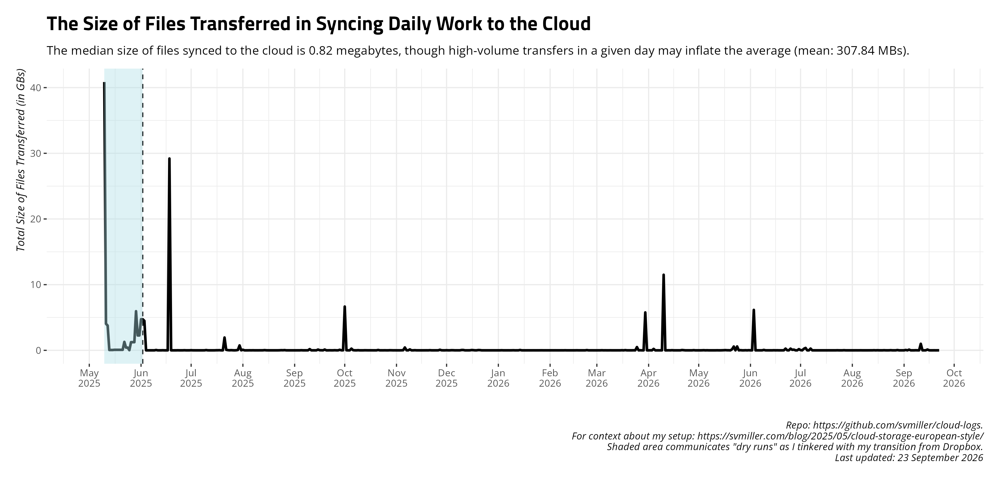
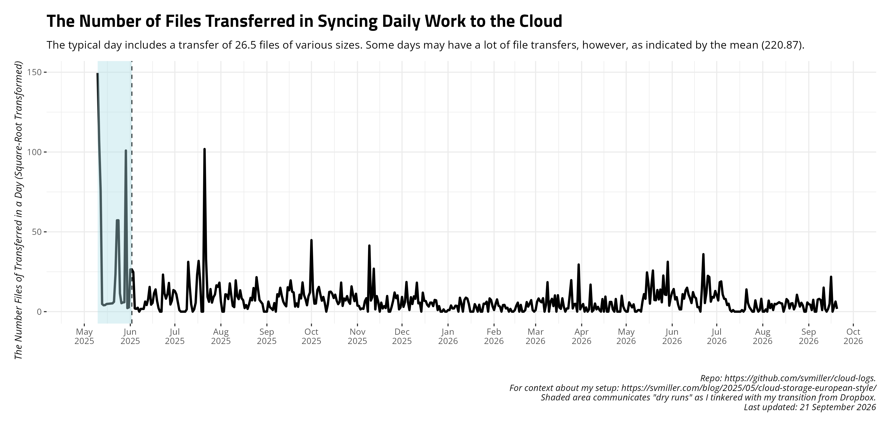

# A Summary of Daily Cloud Syncs

This is a silly project of mine to track/automate my daily work activity
and syncs to my cloud storage. You can [read a bit more about my setup
here](https://svmiller.com/blog/2025/05/cloud-storage-european-style/).
Every day, I sync my main cloud storage to a backup cloud provider and
log the files transferred, the total size of files transferred, and the
time elapsed to sync my main cloud storage provider to my backup. This
script and repository gathers the last two measures and formats them for
presentation. I have an automated procedure that does this every morning
and uploads to Github.

## Time Elapsed Syncing to Cloud, Daily

## Total Size of Files Transferred, Daily

## Total Number of Files Transferred, Daily

## Summary of Past 14 Days

    #> # A tibble: 14 × 4
    #>    date       ftransfer stransfer   elapsed 
    #>    <date>         <dbl> <chr>       <chr>   
    #>  1 2026-07-14         0 <NA>        12m19.6s
    #>  2 2026-07-15         0 <NA>        15m49.1s
    #>  3 2026-07-16         0 <NA>        10m32.8s
    #>  4 2026-07-17         0 <NA>        22m18.0s
    #>  5 2026-07-18         1 926.506 KiB 5m44.6s 
    #>  6 2026-07-19         0 <NA>        18m26.1s
    #>  7 2026-07-20         2 59.563 KiB  5m46.9s 
    #>  8 2026-07-21       194 766.281 KiB 4m40.3s 
    #>  9 2026-07-22        30 85.817 KiB  4m41.8s 
    #> 10 2026-07-23         8 9.150 MiB   9m39.1s 
    #> 11 2026-07-24         2 65.241 KiB  4m46.2s 
    #> 12 2026-07-25         0 <NA>        4m36.5s 
    #> 13 2026-07-26         0 <NA>        21m4.7s 
    #> 14 2026-07-27        50 17.862 MiB  4m40.5s
