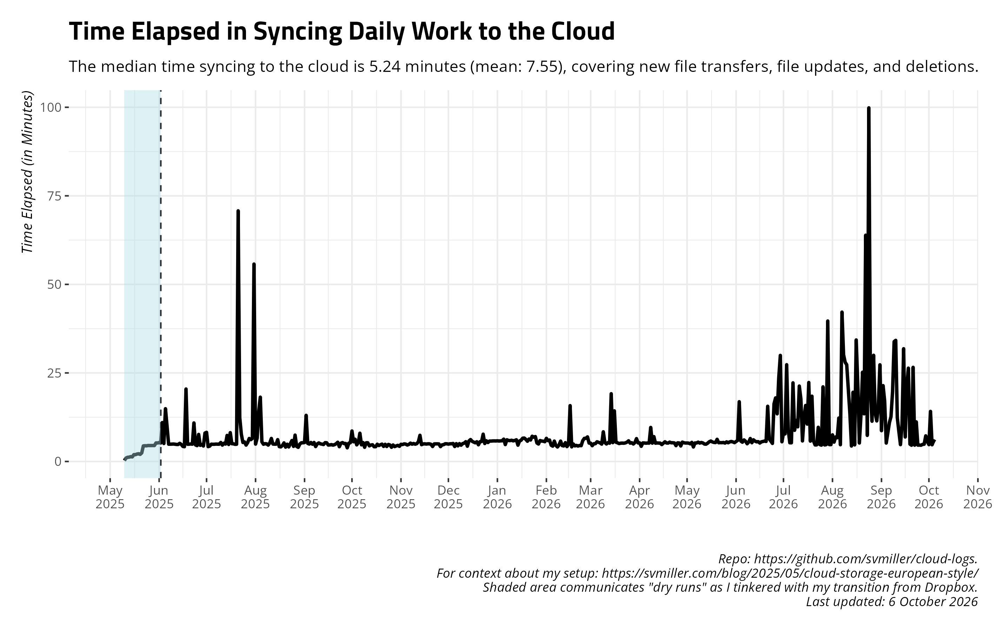
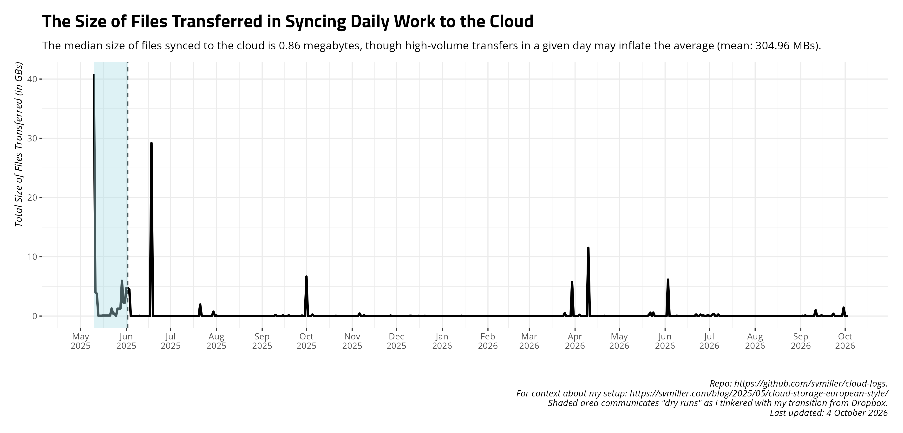
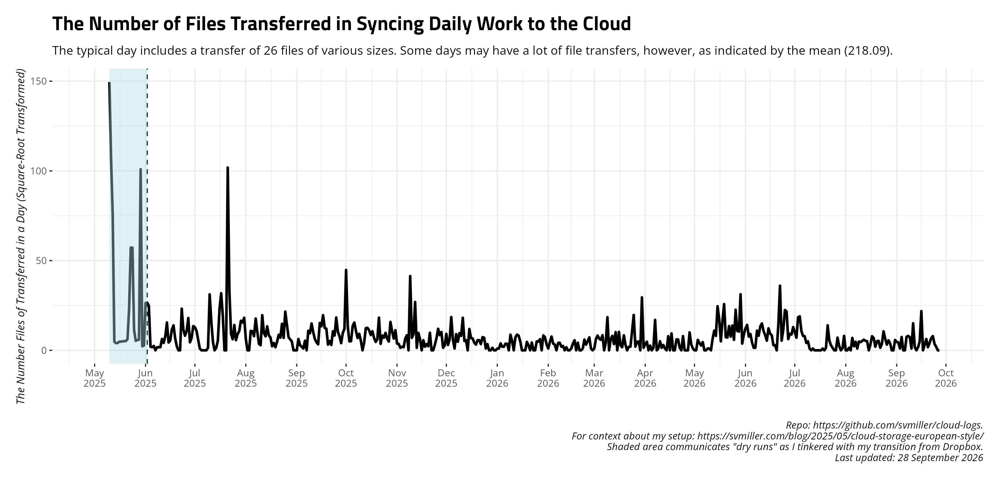

# A Summary of Daily Cloud Syncs

This is a silly project of mine to track/automate my daily work activity
and syncs to my cloud storage. You can [read a bit more about my setup
here](https://svmiller.com/blog/2025/05/cloud-storage-european-style/).
Every day, I sync my main cloud storage to a backup cloud provider and
log the files transferred, the total size of files transferred, and the
time elapsed to sync my main cloud storage provider to my backup. This
script and repository gathers the last two measures and formats them for
presentation. I have an automated procedure that does this every morning
and uploads to Github.

## Time Elapsed Syncing to Cloud, Daily

## Total Size of Files Transferred, Daily

## Total Number of Files Transferred, Daily

## Summary of Past 14 Days

    #> # A tibble: 14 × 4
    #>    date       ftransfer stransfer   elapsed
    #>    <date>         <dbl> <chr>       <chr>  
    #>  1 2026-09-24        13 38.466 MiB  4m36.8s
    #>  2 2026-09-25         4 5.267 MiB   4m38.0s
    #>  3 2026-09-26         0 <NA>        4m35.3s
    #>  4 2026-09-27         0 <NA>        4m49.5s
    #>  5 2026-09-28        22 176.927 KiB 4m52.5s
    #>  6 2026-09-29        11 2.087 MiB   7m14.5s
    #>  7 2026-09-30         7 1.422 GiB   5m36.9s
    #>  8 2026-10-01        34 8.149 MiB   4m45.0s
    #>  9 2026-10-02        29 8.205 MiB   14m8.7s
    #> 10 2026-10-03         0 <NA>        4m42.9s
    #> 11 2026-10-04         0 <NA>        5m49.6s
    #> 12 2026-10-05        20 250.633 KiB 5m33.2s
    #> 13 2026-10-06        29 1.902 MiB   4m55.6s
    #> 14 2026-10-07        20 1.280 MiB   4m34.0s
