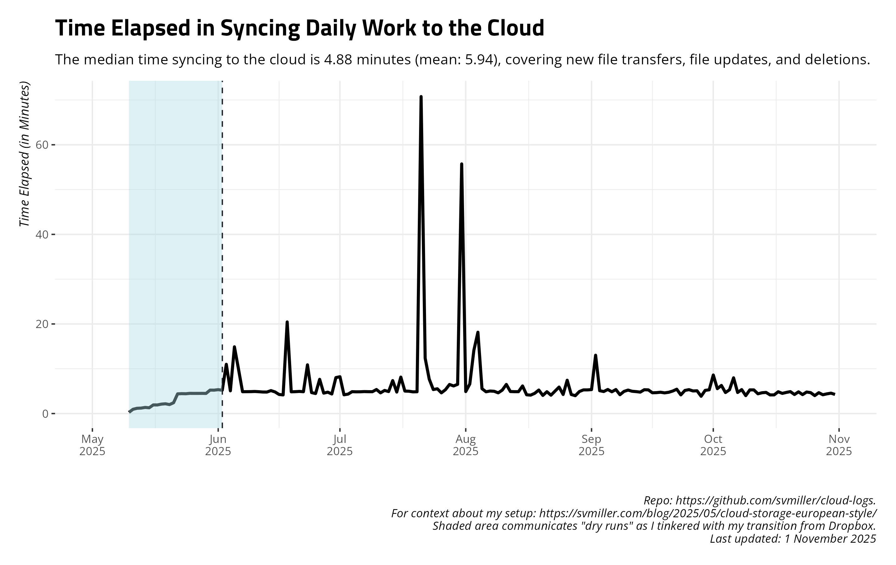

# A Summary of Daily Cloud Syncs

This is a silly project of mine to track/automate my daily work activity
and syncs to my cloud storage. You can [read a bit more about my setup
here](https://svmiller.com/blog/2025/05/cloud-storage-european-style/).
Every day, I sync my main cloud storage to a backup cloud provider and
log the files transferred, the total size of files transferred, and the
time elapsed to sync my main cloud storage provider to my backup. This
script and repository gathers the last two measures and formats them for
presentation. I have an automated procedure that does this every morning
and uploads to Github.

## Time Elapsed Syncing to Cloud, Daily

## Total Size of Files Transferred, Daily

## Total Number of Files Transferred, Daily

## Summary of Past 14 Days

    #> # A tibble: 14 × 4
    #>    date       ftransfer stransfer   elapsed
    #>    <date>         <dbl> <chr>       <chr>  
    #>  1 2025-10-05       183 264.462 MiB 5m18.6s
    #>  2 2025-10-06       240 27.655 MiB  7m58.9s
    #>  3 2025-10-07       117 4.095 MiB   4m42.1s
    #>  4 2025-10-08        47 591.214 KiB 5m20.9s
    #>  5 2025-10-09        85 20.453 MiB  4m0.2s 
    #>  6 2025-10-10        28 34.344 KiB  5m16.9s
    #>  7 2025-10-11         0 <NA>        5m16.8s
    #>  8 2025-10-12        19 111.027 KiB 4m24.8s
    #>  9 2025-10-13       153 10.286 MiB  4m38.6s
    #> 10 2025-10-14       157 6.146 MiB   4m43.3s
    #> 11 2025-10-15       126 2.207 MiB   4m9.6s 
    #> 12 2025-10-16        73 3.849 MiB   4m10.2s
    #> 13 2025-10-17       113 3.125 MiB   4m52.3s
    #> 14 2025-10-18        48 633.468 KiB 4m30.2s
