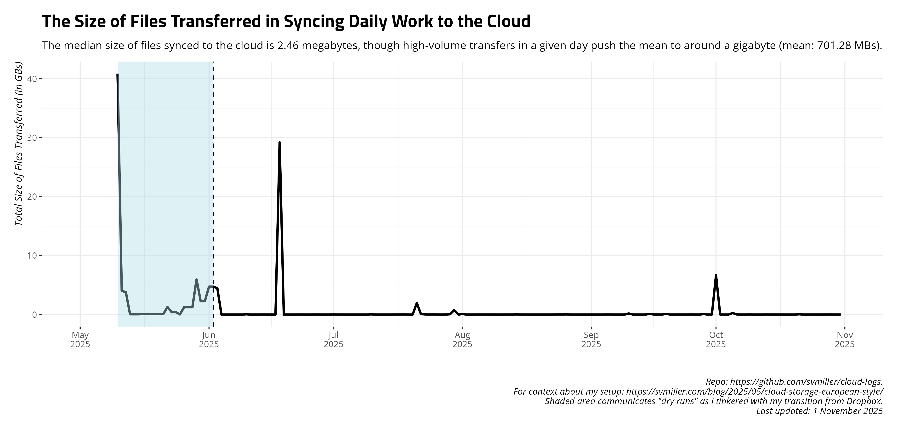

# A Summary of Daily Cloud Syncs

This is a silly project of mine to track/automate my daily work activity
and syncs to my cloud storage. You can [read a bit more about my setup
here](https://svmiller.com/blog/2025/05/cloud-storage-european-style/).

## Time Elapsed Syncing to Cloud, Daily

## Total Size of Files Transferred, Daily

## Summary of Past 14 Days

    #> # A tibble: 14 × 3
    #>    date       transfer    elapsed
    #>    <date>     <chr>       <chr>  
    #>  1 2025-08-15 5.980 MiB   6m10.0s
    #>  2 2025-08-16 646.182 KiB 4m11.3s
    #>  3 2025-08-17 51.859 KiB  4m7.0s 
    #>  4 2025-08-18 198.560 KiB 4m31.5s
    #>  5 2025-08-19 50.007 KiB  5m15.2s
    #>  6 2025-08-20 371.275 KiB 4m2.9s 
    #>  7 2025-08-21 611.527 KiB 4m52.6s
    #>  8 2025-08-22 496.052 KiB 4m6.1s 
    #>  9 2025-08-23 7.608 MiB   5m0.8s 
    #> 10 2025-08-24 21.815 MiB  5m55.0s
    #> 11 2025-08-25 14.057 MiB  4m15.5s
    #> 12 2025-08-26 33.605 MiB  7m26.6s
    #> 13 2025-08-27 224.264 KiB 4m15.3s
    #> 14 2025-08-28 151.144 KiB 3m59.5s
