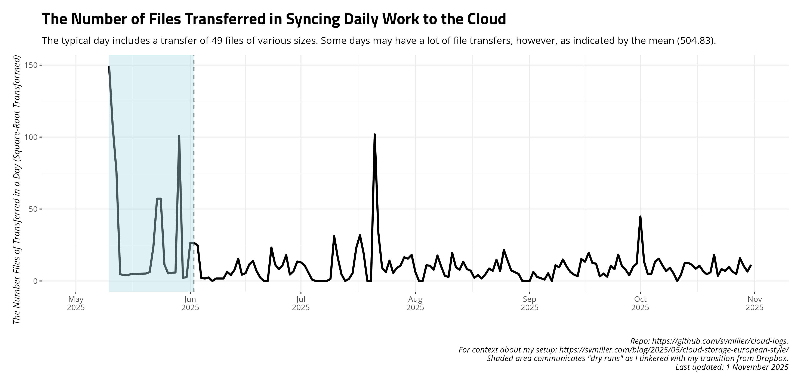

# A Summary of Daily Cloud Syncs

This is a silly project of mine to track/automate my daily work activity
and syncs to my cloud storage. You can [read a bit more about my setup
here](https://svmiller.com/blog/2025/05/cloud-storage-european-style/).
Every day, I sync my main cloud storage to a backup cloud provider and
log the files transferred, the total size of files transferred, and the
time elapsed to sync my main cloud storage provider to my backup. This
script and repository gathers the last two measures and formats them for
presentation. I have an automated procedure that does this every morning
and uploads to Github.

## Time Elapsed Syncing to Cloud, Daily

## Total Size of Files Transferred, Daily

## Total Number of Files Transferred, Daily

## Summary of Past 14 Days

    #> # A tibble: 14 × 4
    #>    date       ftransfer stransfer   elapsed
    #>    <date>         <dbl> <chr>       <chr>  
    #>  1 2026-01-30        53 449.655 KiB 5m43.3s
    #>  2 2026-01-31        11 107.900 KiB 5m34.8s
    #>  3 2026-02-01         1 52.319 KiB  6m32.1s
    #>  4 2026-02-02        22 2.544 MiB   5m52.9s
    #>  5 2026-02-03        59 670.650 KiB 6m3.7s 
    #>  6 2026-02-04        14 2.131 MiB   4m36.0s
    #>  7 2026-02-05        10 255.844 KiB 4m19.8s
    #>  8 2026-02-06         0 <NA>        5m45.5s
    #>  9 2026-02-07        17 378.836 KiB 4m31.8s
    #> 10 2026-02-08        18 2.016 MiB   4m5.3s 
    #> 11 2026-02-09         4 128.871 KiB 4m40.1s
    #> 12 2026-02-10         6 7.213 MiB   5m45.6s
    #> 13 2026-02-11         0 <NA>        4m28.5s
    #> 14 2026-02-12         3 38.536 KiB  4m23.0s
